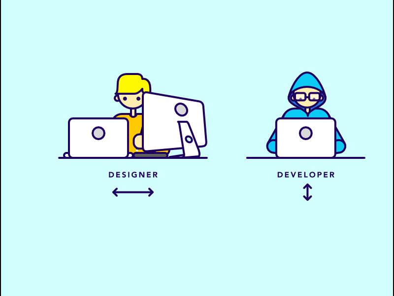
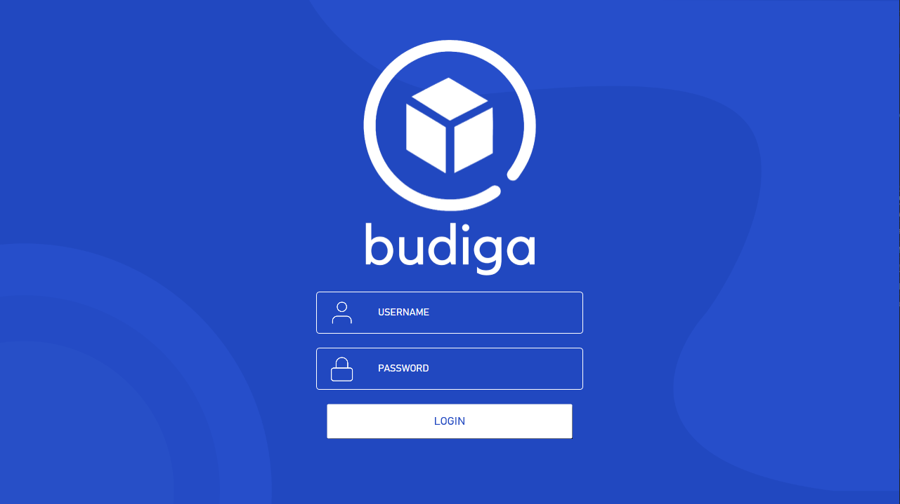
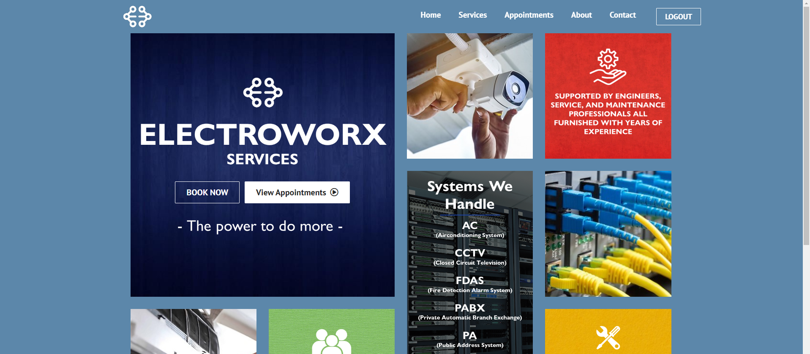
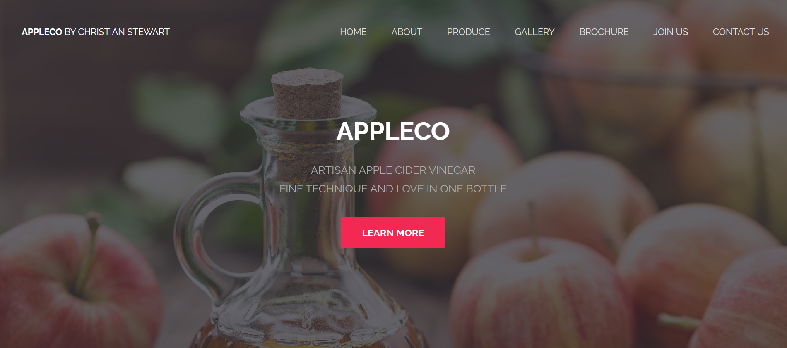

  

<h1 align="center">Hi 👋, I'm Christian Stewart</h1>
<h3 align="center">A hardworking and emerging developer from the Philippines.</h3>

I am currently a 3rd Year Computer Science Student from the University of San Carlos

  

<h3 align="center">Connect with me:</h3>
  

  
  
  
  
  

  

<h3 align="center">Languages and Tools:</h3>

                        

  

  <h3 align="center">Top Languages</h3>

  

  <h3 align="center">Github Stats</h3>
  
&nbsp;

  

  <h3 align="center">Additional Stats</h3>
  
&nbsp;

  

  <h3 align="center">Work Samples</h3>
  

  

  

  

  

<!--
**TheLast22/TheLast22** is a ✨ _special_ ✨ repository because its `README.md` (this file) appears on your GitHub profile.

Here are some ideas to get you started:

- 🔭 I’m currently working on ...
- 🌱 I’m currently learning ...
- 👯 I’m looking to collaborate on ...
- 🤔 I’m looking for help with ...
- 💬 Ask me about ...
- 📫 How to reach me: ...
- 😄 Pronouns: ...
- ⚡ Fun fact: ...
-->
